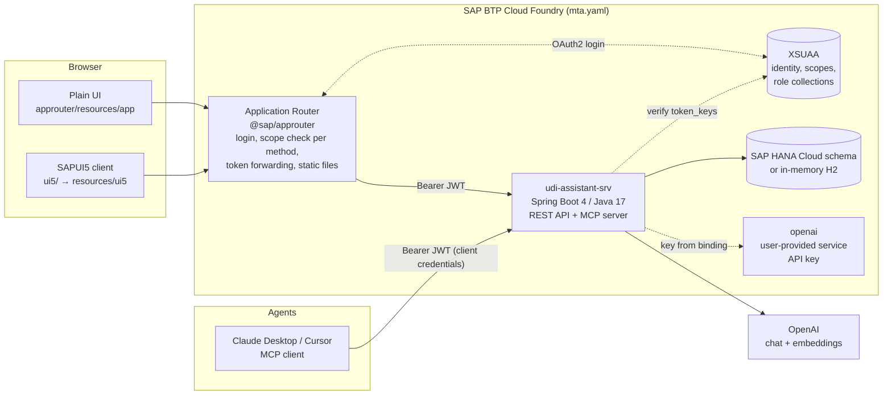
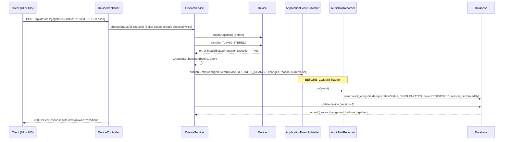
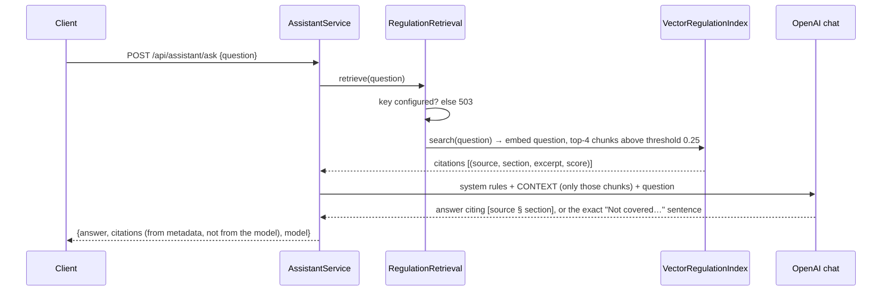

# Architecture

The map of the project: what each part is for, how a request travels, and the sequences behind the four things
the application does. [SPEC.md](SPEC.md) says *what* it must do, [DECISIONS.md](DECISIONS.md) says *why* it is
built this way; this file says *where things are*.

## 1. The big picture



Two clients and one agent path, one API, one set of rules. The service never trusts the router: every request's
token is verified again and the scope rules are enforced a second time.

## 2. Repository layout and the purpose of each part

```
udi-assistant/
├─ mta.yaml              Multitarget application: the deployable unit. Declares the three modules (service, router,
│                        UI5 client) and the resources they need (XSUAA, HANA schema, OpenAI key). `mbt build` turns
│                        it into one archive, `cf deploy` provisions services and pushes apps in dependency order.
├─ xs-security.json      The security contract: scopes Viewer/Editor, role templates, role collections for the
│                        Cockpit, redirect URIs, and `authorities` (what a technical client such as an agent gets).
├─ SPEC.md               Source of truth: domain, rules R1–R8, API, security S1–S6, assistant A1–A7, MCP M1–M5,
│                        UI U1–U7, roadmap. Change the spec first, then tests, then code.
├─ DECISIONS.md          Log of non-obvious decisions and of things that went wrong and what was learned.
├─ README.md             How to run, deploy, demo.
│
├─ srv/                  The service (Spring Boot 4, Java 17). See section 3.
├─ approuter/            The edge. package.json pulls @sap/approuter; xs-app.json is the routing table;
│  └─ resources/         static files the router serves: sign-in page, plain UI (app/), built UI5 client (ui5/).
└─ ui5/                  SAPUI5 client in TypeScript; built by the MTA and copied into approuter/resources/ui5.
```

### The routing table (`approuter/xs-app.json`), top to bottom

| Route | Auth | Purpose |
|---|---|---|
| `/user-api/currentUser` | XSUAA | Who am I: the UIs read name and scopes from here |
| `/api/assistant/*` | XSUAA, Viewer or Editor | Assistant questions are reads, whatever the HTTP method |
| `/api/*` | XSUAA, GET → Viewer or Editor, else Editor | The REST API, forwarded with the user's token |
| `/ui5/*` | XSUAA | The SAPUI5 client |
| `/app/*` | XSUAA | The plain UI |
| `/*` | none | Public: sign-in page and the shared stylesheet |

## 3. The service: package by feature

```
srv/src/main/java/dev/tarekakel/udi/
├─ UdiAssistantApplication      Boot entry point; enables typed configuration properties.
│
├─ device/                      THE DOMAIN. Devices identified by UDI-DI with a registration lifecycle.
│  ├─ Device                    Aggregate root (JPA entity): immutable udiDi, name, manufacturer, risk class, status,
│  │                            @Version for optimistic locking, created/updated audit columns. Methods, not setters:
│  │                            register(), updateDetails(), transitionTo(), auditSnapshot().
│  ├─ RegistrationStatus        Enum with the allowed transitions (State pattern): DRAFT→SUBMITTED→REGISTERED→WITHDRAWN,
│  │                            SUBMITTED→DRAFT. Nothing is ever deleted.
│  ├─ RiskClass                 EU MDR classes I, IIa, IIb, III.
│  ├─ DeviceService             Application service. Enforces invariants (unique UDI-DI, version match, transition
│  │                            allowed) and publishes an EntityChangedEvent for every change. Never writes the trail.
│  ├─ DeviceRepository          Spring Data JPA + Specifications. Package-private: nobody outside uses it directly.
│  ├─ DeviceSpecifications      Composable query predicates (free text over UDI-DI/name/manufacturer, status filter).
│  ├─ DeviceController          REST: list/search, get, create, update, change status, per-device audit trail. No DELETE.
│  ├─ DeviceDtos                Request records with validation (@Gtin14, @NotBlank, reason required).
│  ├─ DeviceResponse            The one outward representation, shared by REST and MCP.
│  ├─ DeviceExceptions          NotFound 404, DuplicateUdiDi 409, InvalidStatusTransition 409, StaleDevice 409.
│  └─ DeviceSeeder              20 demo devices with realistic lifecycle history, only when the table is empty.
│
├─ audit/                       THE TRAIL. Append-only, written in the same transaction as the change (ALCOA+).
│  ├─ EntityChangedEvent        What the domain announces: entity, action, changes, reason, who.
│  ├─ ChangeSet / FieldChange   Field-level diff between two snapshots; an update that changes nothing is empty.
│  ├─ AuditTrailRecorder        Observer: @TransactionalEventListener(BEFORE_COMMIT). CREATE → one row,
│  │                            otherwise one row per changed field. Change and trail commit or roll back together.
│  ├─ AuditEntry                Immutable entity. AuditEntryRepository extends Repository (save + finders only: no delete).
│  ├─ AuditTrailQuery           Read side used by the controller and the MCP tool.
│  └─ AuditTrailController      GET /api/audit-trail (newest 200 across all devices).
│
├─ assistant/                   THE RAG ASSISTANT. Answers only from a versioned corpus, with citations.
│  ├─ RegulationCorpus          Loads regulation/*.md, one chunk per "##" section, with source and section metadata.
│  ├─ RegulationIndex           Interface: search(question) → citations. Swappable retrieval.
│  ├─ VectorRegulationIndex     Implementation on Spring AI SimpleVectorStore + OpenAI embeddings; warms up in the
│  │                            background, non-fatal if the key is wrong.
│  ├─ RegulationRetrieval       Retrieval only (checks the key is configured). Used by the assistant and by MCP.
│  ├─ AssistantService          ask(): retrieve → prompt with context only → answer + citations from metadata.
│  │                            review(device): retrieve → structured findings (severity, rule, message, source).
│  ├─ AssistantPrompts          System rules ("answer only from CONTEXT", exact "not covered" sentence), templates.
│  ├─ AssistantController       POST /api/assistant/ask, GET /api/assistant/sources, POST /api/devices/{id}/review.
│  ├─ AssistantNotConfiguredException  503 when no key: the rest of the app is unaffected.
│  └─ AssistantKeyEnvironmentPostProcessor  Placeholder key so Spring AI starts without one.
│
├─ mcp/                         THE AGENT DOOR. Model Context Protocol server, stateless HTTP at /mcp.
│  ├─ UdiTools                  Four read-only tools: findDevice, searchDevices, getAuditTrail, searchRegulation.
│  │                            Call the same services as REST; domain errors become readable tool errors.
│  └─ McpServerConfig           Publishes the tools; protocol/capabilities live in application.yaml.
│
└─ common/                      Cross-cutting, feature-agnostic.
   ├─ api/                      DomainException (carries its HTTP status) + one ProblemDetail handler (RFC 9457).
   ├─ config/                   AppProperties (typed app.* block), TimeConfig (Clock bean for testable time).
   ├─ persistence/              JPA auditing (createdBy/updatedBy from the current user).
   ├─ security/                 CurrentUserProvider strategy: HeaderCurrentUserProvider (local, X-User) vs
   │                            JwtCurrentUserProvider (cloud, token claims). OpenSecurityConfig (local, permit all)
   │                            vs XsuaaSecurityConfig (cloud: JWT resource server, audience validator, scope→authority
   │                            converter, path rules incl. /mcp).
   └─ validation/               @Gtin14 with the GS1 mod-10 check digit.

srv/src/main/resources/
├─ application.yaml             Datasource follows the HANA binding else H2; Flyway per vendor; OpenAI + assistant
│                               settings; XSUAA from VCAP; MCP server; profile "cloud" switches dev conveniences off.
├─ db/migration/h2|hana/V1…     Schema owned by Flyway, one flavour per database; Hibernate only validates.
├─ regulation/*.md              The assistant's whole knowledge: 7 sources, 27 sections, versioned with the code.
└─ META-INF/spring.factories    Registers the EnvironmentPostProcessor.
```

Tests (`srv/src/test`, 41): GTIN check digit, lifecycle, change detection, scope mapping, corpus parsing (unit);
device API + audit trail on H2, cloud profile with a stubbed JwtDecoder (401/403/who lands in the trail, /mcp
needs a token), assistant with stubbed model + index (prompt contract, citations, structured output), MCP end to
end with the official SDK client (integration). No test calls OpenAI.

## 4. The UI5 client (`ui5/webapp`)

| File | Purpose |
|---|---|
| `manifest.json` | App descriptor: id, libraries, i18n model, routing (`""` → Devices, `device/{id}` → Device). |
| `Component.ts` | Entry point. Creates the API client, resolves the session (mode, user, scopes) into a JSON model, starts the router. |
| `model/ApiClient.ts` | Typed REST client. Same origin; X-User locally; problem details → readable errors; expired session → sign-in page. |
| `model/formatter.ts` | Status colours, dates, risk-class labels. |
| `controller/BaseController.ts` | What every controller needs: router, texts, dialog loading, error display. |
| `controller/Devices.controller.ts` | List: server-side search/status filter, navigation, "New device" dialog. |
| `controller/Device.controller.ts` | Object page: load device + trail, transitions with reason, edit with version. |
| `view/*.xml`, `view/fragment/*.xml` | Dynamic page (list), object page (detail), three dialogs. |
| `i18n/` | English and German. |

## 5. Sequences

### 5.1 Sign-in and first page (BTP)

```mermaid
sequenceDiagram
    participant B as Browser
    participant R as Approuter
    participant X as XSUAA
    participant S as Service
    B->>R: GET /index.html (public sign-in page)
    B->>R: GET /user-api/currentUser
    R-->>B: 302 → XSUAA login
    B->>X: authenticate (SAP ID / IdP)
    X-->>R: authorization code → access token (scopes from role collections)
    R-->>B: session cookie, JSON {name, email, scopes}
    B->>R: GET /api/devices?search=&status=
    R->>R: route matches /api/*, GET → needs Viewer or Editor
    R->>S: GET /api/devices, Authorization: Bearer <JWT>
    S->>X: (cached) JWK set to verify signature
    S->>S: validate exp, audience; scopes → authorities; rule GET /api/** → Viewer|Editor
    S-->>R: 200 page of DeviceResponse
    R-->>B: 200
```

### 5.2 A status change with audit trail



Why it matters: the trail cannot drift from the data (same transaction), carries the reason (R3) and the person
(from the token), and a stale edit (wrong `version`) is refused with 409 rather than overwriting someone's change.

### 5.3 Ask the regulation (RAG)



The corpus is Markdown in the repository (7 sources, 27 sections), so what the assistant "knows" is reviewable and
versioned. `review(device)` runs the same retrieval with a query built from the device's class and status and asks
for structured findings instead of prose.

### 5.4 An agent calls a tool over MCP

```mermaid
sequenceDiagram
    participant Ag as Agent (Claude Desktop via mcp-remote)
    participant X as XSUAA
    participant S as Service /mcp
    participant T as UdiTools
    Ag->>X: client_credentials (service key) → JWT with authorities from xs-security.json (Viewer only)
    Ag->>S: POST /mcp initialize (Bearer JWT)
    S-->>Ag: server info, instructions, capabilities: tools
    Ag->>S: POST /mcp tools/list
    S-->>Ag: findDevice, searchDevices, getAuditTrail, searchRegulation
    Ag->>S: POST /mcp tools/call searchDevices {text: "hersfeld", status: "SUBMITTED"}
    S->>T: searchDevices(...) → DeviceService.search(...)
    T-->>S: List<DeviceResponse>
    S-->>Ag: result (JSON text); a domain error comes back as isError=true with the message
```

Stateless transport: no server session, so instances restart and scale freely. Read-only by design: the technical
client holds `Viewer` only, so even a misbehaving agent cannot write (a POST with its token answers 403).

## 6. Deployment sequence (`mbt build` → `cf deploy`)

1. `mbt` reads `mta.yaml`, builds the service with Maven (tests run), builds the UI5 client (`npm ci`, `ui5 build`)
   and copies it into `approuter/resources/ui5`, installs the router's dependencies, and packages one `.mtar`.
2. `cf deploy` creates or updates the resources: XSUAA from `xs-security.json`, the HANA schema (optional: skipped on
   a trial without the entitlement), and binds the existing `openai` service.
3. It pushes the service (Java buildpack, JRE 17, buildpack auto-configuration switched off) and the router
   (Node.js buildpack), binds services, and starts both. The service reads its bindings from `VCAP_SERVICES`.
4. Once per user, the Cockpit assigns the role collection `udi-assistant-Editor` or `-Viewer`.

## 7. Configuration and environments in one table

| Concern | Local (default profile) | BTP (profile `cloud`) |
|---|---|---|
| Who is the user | `X-User` header, chosen on the sign-in page | XSUAA JWT claims (`user_name`, `email`, `client_id`) |
| Authorization | open | scopes at the router and again in the service |
| Database | in-memory H2, re-seeded on start | SAP HANA Cloud schema when bound, else H2 |
| OpenAI key | `srv/.env` | `openai` user-provided service in `VCAP_SERVICES` |
| Static UI | Spring serves `approuter/resources` | the approuter serves it |
| H2 console | on | off |

## 8. Design patterns, named

| Pattern | Where | Why |
|---|---|---|
| Package by feature | `device`, `audit`, `assistant`, `mcp` | each feature's controller, service, entities together; `common` stays thin |
| Observer (domain events) | `EntityChangedEvent` → `AuditTrailRecorder` | the domain does not know about the trail; the trail cannot be forgotten |
| Strategy | `CurrentUserProvider` (header vs JWT), `RegulationIndex` | swap by profile or by infrastructure without touching callers |
| State | `RegistrationStatus.allowedTransitions()` | the lifecycle is data on the enum, not `if` chains in a service |
| Specification | `DeviceSpecifications` | composable queries shared by REST and MCP |
| Append-only repository | `AuditEntryRepository extends Repository` | no delete method exists to misuse |
| Optimistic locking | `@Version` + `StaleDeviceException` | concurrent editors never silently overwrite each other |
| Problem details | `DomainException` + one handler | every error has a status, a title and a detail (RFC 9457) |
| Defence in depth | router scopes + service scopes | a second router or an internal caller gains nothing |
| Grounded generation | retrieval → prompt → citations from metadata | the model cannot invent a source |
